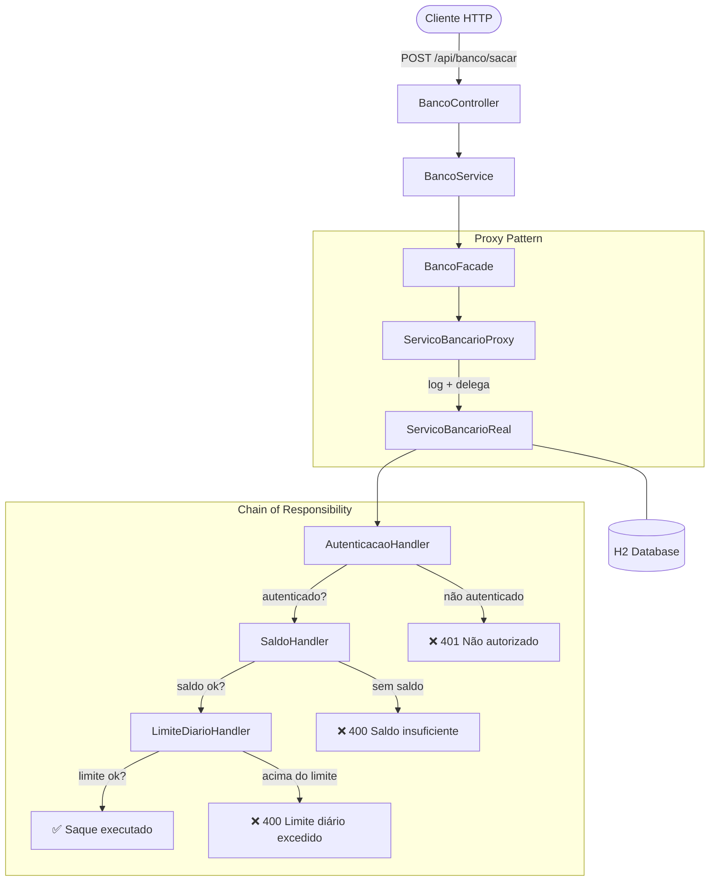

# Sistema Bancário — Design Patterns com Spring Boot

Aplicação REST que demonstra três padrões de projeto clássicos aplicados a um domínio bancário real, construída com Java 17 e Spring Boot 3.

[](https://openjdk.org/projects/jdk/17/)
[](https://spring.io/projects/spring-boot)
[](http://localhost:8080/swagger-ui.html)
[](LICENSE)

---

## Padrões Implementados

| Padrão | Classe principal | Responsabilidade |
|---|---|---|
| **Chain of Responsibility** | `AutenticacaoHandler` → `SaldoHandler` → `LimiteDiarioHandler` | Valida a operação em etapas sequenciais |
| **Proxy** | `ServicoBancarioProxy` | Controla acesso e registra logs antes de delegar ao serviço real |
| **Facade** | `BancoFacade` | Expõe uma interface simples que orquestra toda a complexidade |

---

## Arquitetura



---

## Stack Tecnológica

- **Java 17** — LTS com records, sealed classes e pattern matching
- **Spring Boot 3.4.5** — autoconfiguration e embedded Tomcat
- **Spring Data JPA + Hibernate** — persistência com mapeamento objeto-relacional
- **H2 Database** — banco em memória, zero configuração
- **Lombok** — elimina boilerplate (getters, construtores, builders)
- **Springdoc OpenAPI 2.5** — documentação Swagger gerada automaticamente
- **Maven** — gerenciamento de dependências e build

---

## Como Executar

### Pré-requisitos
- Java 17+
- Maven 3.8+ (ou use o `mvnw` incluso)

### Com Maven
```bash
git clone https://github.com/odavid062/sistema-bancario-padroes-chain-proxy-facade.git
cd sistema-bancario-padroes-chain-proxy-facade/Sistema
./mvnw spring-boot:run
```

### Com Docker
```bash
git clone https://github.com/odavid062/sistema-bancario-padroes-chain-proxy-facade.git
cd sistema-bancario-padroes-chain-proxy-facade
docker compose up
```

A API estará disponível em `http://localhost:8080`.

---

## Endpoints

| Método | Rota | Descrição |
|---|---|---|
| `POST` | `/api/banco/sacar` | Realiza uma operação de saque |

### Exemplo de requisição
```bash
curl -X POST http://localhost:8080/api/banco/sacar \
  -H "Content-Type: application/json" \
  -d '{"clienteId": 1, "valor": 500.00}'
```

### Respostas possíveis
```json
// 200 OK
"Saque de R$ 500.00 realizado com sucesso."

// 401 Unauthorized
"Operação negada: cliente não autenticado."

// 400 Bad Request
"Operação negada: saldo insuficiente."

// 400 Bad Request
"Operação negada: limite diário excedido."
```

---

## Documentação Interativa (Swagger)

Após subir a aplicação, acesse:

```
http://localhost:8080/swagger-ui.html
```

Você pode testar todos os endpoints diretamente pelo navegador, sem precisar de Postman ou curl.

---

## Estrutura do Projeto

```
Sistema/src/main/java/com/example/Banco/
├── controller/
│   └── BancoController.java          # Entrada HTTP REST
├── dto/
│   └── OperacaoDTO.java              # Dados da requisição (clienteId, valor)
├── model/
│   └── Cliente.java                  # Entidade JPA
├── repository/
│   └── ClienteRepository.java        # Acesso ao banco via Spring Data
├── service/
│   └── BancoService.java             # Lógica de orquestração
└── pattern/
    ├── chain/
    │   ├── Handler.java              # Interface do padrão Chain
    │   ├── AutenticacaoHandler.java  # Valida se cliente está autenticado
    │   ├── SaldoHandler.java         # Valida saldo disponível
    │   └── LimiteDiarioHandler.java  # Valida limite diário de saque
    ├── proxy/
    │   ├── ServicoBancario.java      # Interface do serviço
    │   ├── ServicoBancarioProxy.java # Logging e controle de acesso
    │   └── ServicoBancarioReal.java  # Implementação real do saque
    └── facade/
        └── BancoFacade.java          # Interface simplificada para o cliente
```

---

## Cenários de Teste Automáticos

Ao iniciar a aplicação, três cenários são executados automaticamente:

1. **Saque válido** — cliente autenticado, saldo suficiente, dentro do limite diário
2. **Limite diário excedido** — operação bloqueada pelo `LimiteDiarioHandler`
3. **Cliente não autenticado** — operação bloqueada pelo `AutenticacaoHandler`

---

## Por que esses padrões?

**Chain of Responsibility** evita condicionais aninhados (`if/else if/else`) para validações. Cada regra de negócio vive em sua própria classe, facilitando adicionar ou remover validações sem tocar no código existente — princípio Open/Closed do SOLID.

**Proxy** centraliza cross-cutting concerns como logging e controle de acesso em um único ponto, sem poluir a lógica de negócio do serviço real.

**Facade** simplifica o uso do subsistema por parte do controller: em vez de conhecer proxy, chain e repositório, o controller fala apenas com a facade — reduzindo acoplamento.

---

## Autor

**David Rodrigues**
[](https://github.com/odavid062)

---

## Licença

[MIT](LICENSE)
